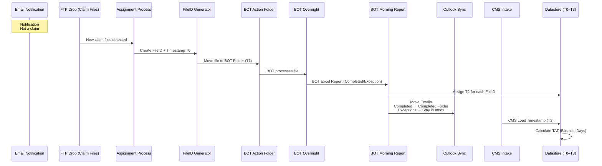

# 🧩 TECHNICAL SOLUTIONS DOCUMENT
## End-to-End Claim Tracking + True TAT + Accurate Counts
### Incorporating Email Notifications + FTP → BOT Workflow

**Version 1.0**

---

## 1. Executive Summary

Sun Life receives:

- **Email notifications** from 6 administrators
- **Claim files via FTP**, which contain the actual claims

**Current issues** (inaccuracy, exceptions lost, wrong counts) arise because email notifications are being treated as claims.

This document provides a fully accurate, auditable system for:

✔ Tracking the true number of claims received  
✔ Tracking completed vs. exception cases  
✔ Mapping BOT and manual processing  
✔ Calculating true turnaround time (TAT)  
✔ Automating Outlook email movement  
✔ Creating 1:1 lifecycle tracking of every claim  

All diagrams are in Mermaid.

---

## 2. High-Level System Overview

```mermaid
flowchart TD
    A[Email Notifications (Indicators Only)] --> B[Inbox Tracking - Not Claims]
    C[FTP Claim Files (Source of Truth)] --> D[Assignment Job - Extract and Count Files]
    D --> E[Assign FileID and T0]
    E --> F[Move Files to BOT Action Folder - Assign T1]
    F --> G[BOT Overnight Processing]
    G --> H[BOT Morning Report: Completed / Exceptions / Pending]

    H --> I[Completed Files - Move Emails to Completed - Assign T2]
    H --> J[Business Exceptions - Keep Emails in Inbox - Assign T2]
    H --> K[Pending - No Movement]

    I --> L[CMS Intake Validation - Assign T3]
    J --> L
    L --> M[Final TAT and Accurate Counts]
```

---

## 3. Updated Principles

✔ Emails are notifications, not claims  
✔ FTP files are the true source of claims  
✔ BOT results dictate Completed vs. Exception  
✔ Email movement must happen AFTER the BOT report  
✔ Meritain ZIP files must be expanded and tracked individually  
✔ TAT requires full lifecycle timestamps (T0 → T3)

---

## 4. Lifecycle Timestamps (Required for True TAT)

| Timestamp | Meaning | Source |
|-----------|---------|--------|
| **T0** | Claim file arrived in FTP | FTP metadata / assignment job |
| **T1** | File moved to BOT Action folder | BOT submission script |
| **T2** | BOT result time (Completed/Exception) | BOT morning report |
| **T3** | File successfully loaded into CMS | Data Intake Validation Report |

### Turnaround Time Formula

```
TAT = BusinessDays(T0 → T3)
```

---

## 5. FileID Strategy (Required for 1:1 Accuracy)

Every claim file receives a stable identifier:

```
<Admin>_<RawFilename>_<YYYYMMDDHHMMSS>_<Hash>
```

### Meritain ZIP Splitting

```
ZIPID = <Admin>_<ZipName>_<Timestamp>
ChildID = <ZIPID>_<InnerFileName>_<Hash>
```

Each extracted file becomes its own claim with its own lifecycle.

---

## 6. Detailed Data Flow (Visual)



---

## 7. Inbox Management Rules (Critical)

### Night Before:
- Assignment job counts claims
- Files are moved to BOT Action folder
- Notification emails remain untouched

### Morning BOT Report:
- **Completed** → move matching notifications to Completed folder
- **Exceptions** → leave notifications in Inbox
- **Pending** → no movement

### Why this works:
✔ Completed folder = true completed work  
✔ Inbox = true exception inventory  
✔ No double-counting  
✔ Email counts finally match real BOT outcomes

---

## 8. Accurate Counts (Redefined)

### Count 1 — Claims Received (Accurate)
- **Source:** FTP → expanded ZIP contents → FileIDs
- Emails irrelevant.

### Count 2 — Claims Completed (Accurate)
**Source:**
- BOT completed files
- Exceptions are NOT counted
- CMS validation ensures final completion

### Count 3 — Email Notifications Received
- Useful for trend analysis, but NOT claim volume.

---

## 9. Unified Datastore Structure

| FileID | Admin | OriginalFile | ParentZIP | T0 | T1 | T2 | T3 | BOT Result | ManualTime | TAT |
|--------|-------|--------------|-----------|----|----|----|----|------------|------------|-----|
|        |       |              |           |    |    |    |    |            |            |     |

This table powers:
- TAT calculations
- Exception tracking
- Admin-level performance
- Daily volume reporting
- BOT accuracy analysis

---

## 10. Complete Lifecycle Diagram

```mermaid
flowchart LR
    A[FTP Claim Files] --> B[Assign FileID + T0]
    B --> C[Move to BOT Action Folder<br>Assign T1]
    C --> D[BOT Processing Overnight]
    D --> E[BOT Morning Report]
    
    E --> F[Completed<br>Assign T2]
    F --> G[Move related emails to Completed Folder]
    
    E --> H[Exceptions<br>Assign T2]
    H --> I[Keep emails in Inbox]
    
    F --> J[CMS Load Validation<br>Assign T3]
    H --> J
    
    J --> K[1:1 TAT Calculation<br>(BusinessDays T0→T3)]
```

---

## 11. Final Output: TAT, Counts, and Accuracy

This system provides:

✔ True TAT based on FTP → CMS lifecycle  
✔ Accurate daily claim volume based on FTP file count  
✔ Accurate daily completions based on BOT + CMS  
✔ Clear identification of all exceptions  
✔ Automated Outlook inbox cleanup and integrity  
✔ 1:1 tracking for every claim file

---

## 12. Implementation Roadmap

### Phase 1 — Foundation
- FileID generator
- FTP extraction
- ZIP expansion
- Datastore creation

### Phase 2 — BOT Automation
- BOT report parser
- T1 / T2 tracking
- Exception flagging

### Phase 3 — Outlook Automation
- Email matching + movement script

### Phase 4 — TAT Engine
- T0–T3 population
- Business-day logic

### Phase 5 — Reporting
- Daily CSV
- Dashboard
- Bot efficiency KPI
- Exception backlog KPI
